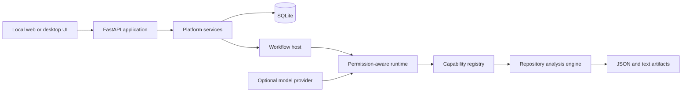

# RevEng

RevEng is a local-first Python repository analysis system with a visual control center for running analyses, inspecting evidence, composing reusable capabilities, and governing which tools and files an agent may use.

The repository contains a working system—not a UI mockup. A fresh database is migrated and seeded at startup with 52 executable capabilities and three analysis workflows. Static analysis works without an API key; model-assisted narration is optional.

## What it demonstrates

- Multi-pass Python repository mapping: inventory, relationships, file breakdowns, clusters, flows, dossier generation, validation, and explicit unknowns.
- A layered meaning pipeline that derives actions, functions, file purpose and behavior, workflows, modules, subsystems, and a provisional system summary.
- A storage-backed capability platform with contracts, executable bindings, composite capabilities, draft validation, publication history, and rollback.
- Agent-scoped tool grants and file keycards enforced at the runtime boundary.
- Durable SQLite state for agents, runs, events, outputs, capabilities, permissions, and migrations.
- A FastAPI/Jinja control center plus an optional native desktop shell.

## Architecture



The durable capability catalog is the source of truth. Runtime registries are projections of that catalog, and workflows invoke capabilities through the runtime so permission checks, logging, caching, and artifact tracking stay in one path. See [ARCHITECTURE.md](ARCHITECTURE.md) for the component boundaries.

## Quick start

Requirements: Python 3.11 or newer.

```powershell
python -m venv .venv
.\.venv\Scripts\Activate.ps1
python -m pip install --upgrade pip
python -m pip install -r requirements.txt
python server.py
```

Open <http://127.0.0.1:8080>. The server binds to localhost by default.

An editable package install (`python -m pip install -e .`) also provides the `reveng` command.

For the optional desktop shell:

```powershell
python desktop.py
```

No provider credentials are needed for the static workflows. To enable model-assisted analysis, copy `.env.example` to `.env` and configure an OpenAI-compatible provider.

## Testing

```powershell
python -m unittest discover -s tests
```

The suite exercises database migrations, capability publication and rollback, permission enforcement, the web UI, host composition, static workflows, layered meaning outputs, and the recovered parallel execution adapter.

## Local-data boundary

RevEng is designed for local use. Its database, `.env`, generated artifacts, test workspaces, and copied agent assets are ignored by Git. The browser UI loads its application assets locally and does not depend on a third-party JavaScript CDN. Network requests occur only when a user configures and invokes a remote model provider (or follows the WebView2 installation link shown by the desktop launcher).

The application has no authentication layer. Keep the default `127.0.0.1` binding; do not expose it directly to a network. See [SECURITY.md](SECURITY.md) and [ASSETS.md](ASSETS.md) before publishing or redistributing the project.

## Current scope

- Repository analysis targets Python source code.
- Model-assisted output depends on the configured provider and is not required for core analysis.
- Capability uninstall/deprecation and stored revision diffs are not yet exposed in the UI.
- The desktop packaging specification is development-ready but not a signed installer pipeline.

## License

RevEng is available under the [MIT License](LICENSE).
